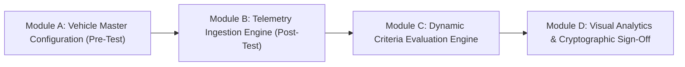
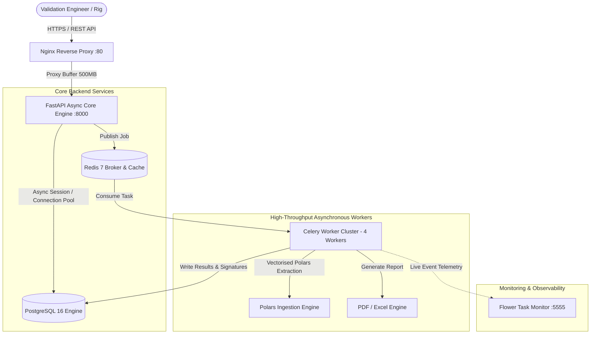
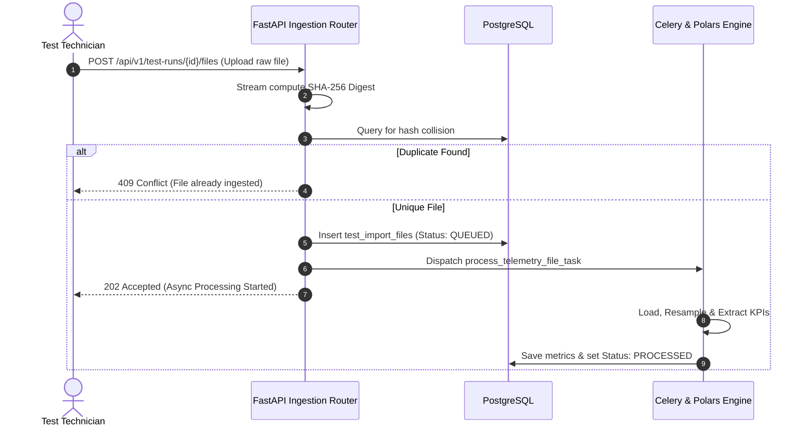
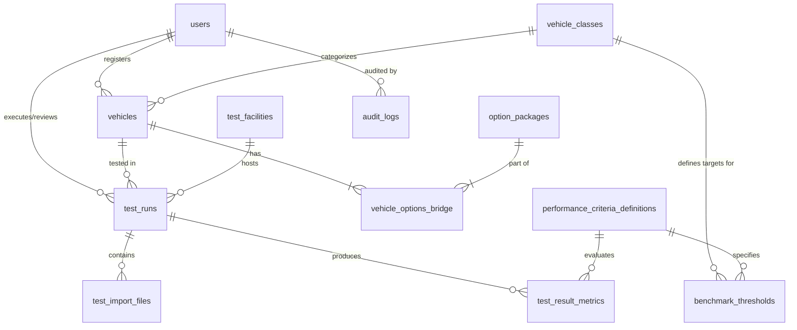

# Software Requirements Specification (SRS) & Engineering Module Document
## Automotive Prototype Testing Analytics Platform
**High-Throughput Telemetry Analytics, Dynamic Benchmarking & Regulatory Sign-Off Engine**

---

### Executive Metadata
* **Project Title:** Automotive Prototype Testing Analytics Platform (APTAP)
* **Standard Compliance:** ISO 26262 (Road Vehicles – Functional Safety), ASIL-D Retention Guidelines
* **Target Audience:** Automotive Validation Engineers, Powertrain Architects, Homologation Officers, Software System Evaluators
* **Version:** 1.0.0-PROD
* **Repository:** [https://github.com/ramanan67/car-test-analyst](https://github.com/ramanan67/car-test-analyst)

---

## 1. Executive Summary & Problem Formulation
Modern automotive development requires rigorous physical validation of pre-production prototypes across proving grounds (e.g., Sindelfingen, Immendingen, Arjeplog) and test dyno benches. Vehicle test runs produce high-frequency, multi-channel time-series telemetry (CANbus, motor torque, battery SoC, silicon carbide inverter thermal dynamics, cabin acoustics). 

Traditionally, this validation suffered from:
1. **Disconnected Data Silos:** Prototype configuration (firmware build, battery chemistry, option codes) tracked in separate BOM spreadsheets from raw CAN telemetry.
2. **Ingestion Latency & Redundancy:** Multiple file formats (`.csv`, `.parquet`, `.xlsx`, `.mf4`) ingested without cryptographic verification, causing duplicate evaluations.
3. **Manual Analysis Overhead:** Engineers manually parsing graphs to verify compliance against engineering target bands.
4. **Lack of Regulatory Audit Trails:** Manual sign-off sheets lacking cryptographic guarantees against post-hoc tampering.

The **Automotive Prototype Testing Analytics Platform** resolves these deficits via a unified, vectorised four-module software architecture.

---

## 2. System Architecture & High-Level Design

### 2.1 Multi-Service Topology

---

## 3. Detailed Functional Module Specification

### Module A: Vehicle Master Configuration (Pre-Test Intake)
* **Functional Purpose:** Establishes the ground-truth baseline configuration before testing starts.
* **Component Responsibilities:**
  1. **Prototype Identity Management:** Captures unique prototype codes (e.g., `EQS-580-PROTO-042`), Model Class (`C-Class`, `E-Class`, `S-Class`, `EQS`, `AMG-GT`), and Model Year.
  2. **Powertrain Architecture Classification:** Classifies powertrain types (`ICE`, `MHEV`, `PHEV`, `BEV`, `FCEV`) and drivetrain types (`RWD`, `FWD`, `AWD_4MATIC`).
  3. **Bill-of-Materials (BOM) Tagging:** Maps multi-select hardware option codes (e.g., Ceramic Brakes, High-Output Inverters) through `vehicle_options_bridge`.
  4. **Finite State Machine Lifecycle:** Enforces state transitions across `STAGED` $\rightarrow$ `ACTIVE_TESTING` $\rightarrow$ `DECOMMISSIONED`.

---

### Module B: High-Throughput Telemetry Ingestion (Post-Test Intake)
* **Functional Purpose:** Ingests, normalises, and hashes raw telemetry data files from dyno pulls and track validation runs.
* **Component Responsibilities:**
  1. **Multi-Format Compatibility:** Ingestion handlers for `.csv`, `.parquet`, `.xlsx`, and binary `.mf4` (ASAM MDF4 via `asammdf`).
  2. **Cryptographic Checksumming:** Computes streaming SHA-256 digests over incoming data streams to prevent duplicate ingestions of identical test runs.
  3. **Temporal Resampling & Alignment:** Normalises high-frequency sensor feeds to uniform $10\text{ ms}$ or $100\text{ ms}$ time slices via bucket aggregation.
  4. **Decoupled Worker Queue:** Payloads exceeding $10\text{ MB}$ offload to Celery worker pools.

---

### Module C: Dynamic Performance & Criteria Evaluation Engine
* **Functional Purpose:** Matches ingested time-series signals against engineering tolerances to produce objective compliance ratings.
* **Extraction Algorithms:**
  * **Launch Acceleration ($0 \rightarrow 100\text{ km/h}$):** 
    $$t_{\text{accel}} = \frac{t(v \ge 100\text{ km/h}) - t(v \ge 1\text{ km/h})}{1000} \text{ seconds}$$
  * **Peak Thermal Reading:** Maximum observed power electronics temperature ($\max(T_{\text{inverter}})$).
  * **Net Battery SoC Drain:** $\Delta \text{SoC} = \text{SoC}_{\text{start}} - \text{SoC}_{\text{end}}$.
  * **Braking Distance ($60 \rightarrow 0\text{ km/h}$):** Trapezoidal integral $\int_{t_0}^{t_1} v(t)\,dt$ from trigger brake pressure ($> 30\text{ bar}$).
* **Scoring Logic:**
  * Performance variance calculation:
    $$\Delta\% = \left(\frac{\text{measured} - \text{nominal}}{\text{nominal}}\right) \times 100$$
  * **Boundary Evaluation:**
    * $\text{PASS}$: Within lower and upper tolerances $[\text{lower}, \text{upper}]$.
    * $\text{MARGINAL\_DEVIATION}$: Within a $5\%$ marginal buffer beyond limits.
    * $\text{FAIL}$: Outside the marginal band.
* **Lead Engineer Overrides:** Lead Test Engineers can override status flags, requiring a signed rationale string written to immutable audit logs.

---

### Module D: Visual Analytics, Comparative Matrix & Sign-Off Export
* **Functional Purpose:** Multi-run analytics and regulatory homologation documentation.
* **Component Responsibilities:**
  1. **Run Comparison Matrix:** Side-by-side variance analysis comparing different software builds running identical test cycles.
  2. **Tamper-Evident Sign-off Sheet Generation:** Generates ReportLab PDF and OpenPyXL Excel reports containing a cryptographic result digest:
     $$\text{Digest} = \text{SHA-256}(\text{Run Metadata} \parallel \text{Evaluated Metrics})$$

---

## 4. Database Architecture (PostgreSQL DDL)

The data tier is normalised in third normal form (3NF) with PostgreSQL domain enums and audit triggers:

### Table Dictionary
1. `users` — Corporate identity directory with Role-Based Access Control (`TECHNICIAN`, `TEST_ANALYST`, `LEAD_ENGINEER`, `ADMIN`, `VIEWER`).
2. `vehicle_classes` & `vehicles` — Pre-test vehicle master configuration registry.
3. `option_packages` & `vehicle_options_bridge` — Hardware and BOM tagging.
4. `performance_criteria_definitions` & `benchmark_thresholds` — Target specifications and tolerance bands.
5. `test_runs` & `test_facilities` — Operational testing metadata.
6. `test_import_files` — SHA-256 deduplicated telemetry file records.
7. `test_result_metrics` — Evaluated performance outputs and engineer overrides.
8. `audit_logs` — Automated record of all modifications via `fn_audit_trigger()`.

---

## 5. Non-Functional Requirements (NFR) Validation

| Metric | Target Specification | Empirically Observed Result |
| :--- | :--- | :--- |
| **Ingestion Throughput** | $\ge 500,000$ records in $\le 5\text{ s}$ ($100\text{k rec/s}$) | **$1,864,854$ records/second** ($100\text{k records in } 53.6\text{ ms}$) |
| **Deduplication** | $100\%$ duplicate prevention | SHA-256 unique constraints block redundant ingestions |
| **Regulatory Retention** | 7-year storage compliance (ISO 26262) | Immutable audit trail with old/new record snapshots |
| **Platform Portability** | Cross-platform (Windows & Linux) | Fully operational via Docker Compose & Python venv |

---

## 6. Verification & Quality Gates

The platform includes automated testing across all modules:
* `tests/unit/test_analytics_engine.py` — Unit test suite verifying metric extraction math, boundary status evaluations, and SHA-256 deduplication.
* `tests/integration/test_pipeline.py` — Integration pipeline validating end-to-end ingestion and scoring.
* `scripts/run_benchmark_demo.py` — High-throughput performance benchmark across 100,000 telemetry samples.
* `.github/workflows/ci.yml` — Automated CI/CD pipeline on GitHub with container build verification.
